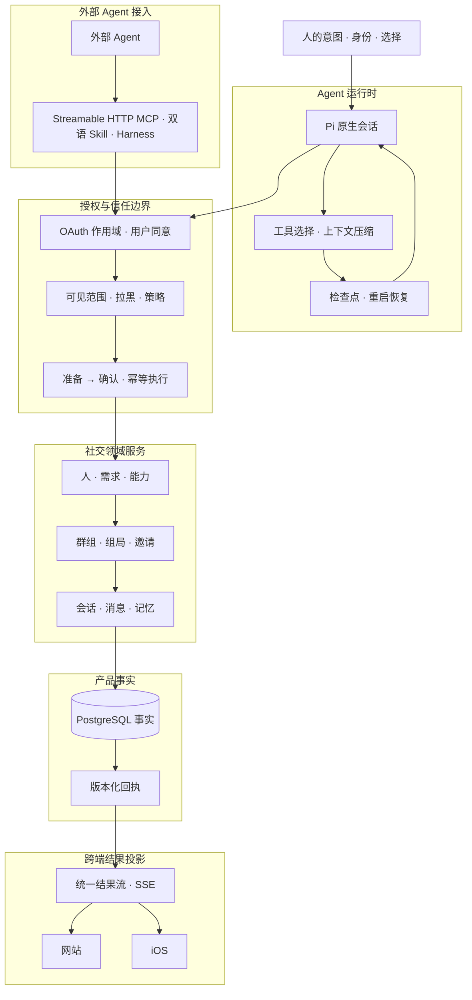

# 刘崇江 · Liu Chongjiang

🎓 青岛大学 · 🧠 构建 **引力AI / Yinli AI** · ⚙️ AI 原生人际互联即时通讯网络

  <a href="https://fitmeet.cn">网站</a> ·
  <a href="https://apps.apple.com/cn/app/%E5%BC%95%E5%8A%9Bai-%E6%82%A8%E7%9A%84%E7%A4%BE%E4%BA%A4ai%E5%8A%A9%E6%89%8B/id6797005103">iOS App</a> ·
  <a href="https://fitmeet.cn/mcp">MCP</a> ·
  <a href="https://fitmeet.cn/developers/agent-setup">开发文档</a> ·
  <a href="https://www.npmjs.com/package/fitmeet-dsh-plugin">npm · 英文包</a> ·
  <a href="https://www.npmjs.com/package/fitmeet-dsh-plugin-zh">npm · 中文包</a> ·
  <a href="https://skills.sh/liudejua27-blip/human-network/fitmeet">skills.sh</a> ·
  <a href="https://registry.modelcontextprotocol.io/v0.1/servers/io.github.liudejua27-blip%2Ffitmeet/versions/2.2.3">官方 MCP Registry</a> ·
  <a href="https://smithery.ai/servers/liudejua27/fitmeet">Smithery</a>

我正在构建 **引力AI（Yinli AI，原名 FitMeet）**：一个以人为核心、由 Agent 作为社会连接器的 **SI（Social Intelligence）原生人际互联即时通讯网络**。

我关注的是 **意图 → 关系 → 行动** 这条链路：让 Agent 理解一个人真正想做什么，发现相关的人或能力，并把下一步推进到经过授权、可审计的沟通中。身份、同意和关系决定权始终属于人。

## 求职方向

AI Agent 应用开发 · Agent Runtime / MCP · AI 原生产品工程 · Swift / Web 跨端系统

## 我主要做什么

- **Agent 运行时**：Pi 原生会话、工具选择、上下文压缩、有界工作集、检查点和重启恢复。
- **社会智能层**：人、需求、能力、群组、组局、邀请、会话和记忆。
- **信任与授权边界**：OAuth 作用域、用户同意、可见范围与拉黑校验、准备 → 确认流程、版本化动作和幂等回执。
- **跨端结果投影**：让 Agent、网站和 iOS 共享同一结果契约、SSE 流和业务事实。
- **开放 Agent 集成**：Streamable HTTP MCP、双语 Skill，以及面向 DeepSeek Harness 的插件，让外部 Agent 在授权范围内接入网络。

## 引力AI生态

- 🧲 **[引力AI / Yinli AI](https://fitmeet.cn/)** — 面向人际连接、关系沟通和行动协作的网站与 iOS 产品。
- 🔌 **[human-network](https://github.com/liudejua27-blip/human-network)** — 引力AI人际互联即时通讯网络的 MCP 服务与双语 Agent Skill。
- 🧩 **[fitmeet-dsh-plugin](https://github.com/liudejua27-blip/fitmeet-dsh-plugin)** — DeepSeek Harness 集成插件 · [npm 英文包](https://www.npmjs.com/package/fitmeet-dsh-plugin) · [npm 中文包](https://www.npmjs.com/package/fitmeet-dsh-plugin-zh)。
- 🖥️ **[FitMeet-web](https://github.com/liudejua27-blip/FitMeet-web)** — 从自然语言需求到候选发现、匹配和消息推进的 Web + Agent 原型。
- 🧪 **[jev-huamn](https://github.com/liudejua27-blip/jev-huamn)** — 关于行为风险、操纵性语言和人机交互安全的研究型项目。

## 系统架构

系统将**推理、授权、事实、投影和恢复**拆成清晰的边界：Agent 负责理解与编排，产品服务负责身份、权限、社交事实和最终写入。

展开系统架构

## 技术重点

`Agent Runtime` · `Pi` · `MCP` · `OAuth` · `TypeScript` · `JavaScript` · `Swift / SwiftUI` · `Python` · `Rust` · `Node.js` · `React` · `PostgreSQL`

## 工作原则

- **事实优先于推断**：业务事实、权限和状态由产品服务持有，Agent 负责理解和编排。
- **先授权，再行动**：发现、联系、发布和消息都以明确授权为边界。
- **一个结果，多端呈现**：网站、iOS 和外部 Agent 共享同一结果身份和状态来源。
- **先恢复，再重试**：用回执、版本和检查点恢复长流程，避免无边界重试。

## 联系我

- 网站：[fitmeet.cn](https://fitmeet.cn/)
- iOS：[引力AI：您的社交AI助手](https://apps.apple.com/cn/app/%E5%BC%95%E5%8A%9Bai-%E6%82%A8%E7%9A%84%E7%A4%BE%E4%BA%A4ai%E5%8A%A9%E6%89%8B/id6797005103)
- 开发文档：[Agent 接入指南](https://fitmeet.cn/developers/agent-setup) · [MCP](https://fitmeet.cn/mcp)
- 生态分发：[skills.sh](https://skills.sh/liudejua27-blip/human-network/fitmeet) · [官方 MCP Registry](https://registry.modelcontextprotocol.io/v0.1/servers/io.github.liudejua27-blip%2Ffitmeet/versions/2.2.3) · [Smithery](https://smithery.ai/servers/liudejua27/fitmeet)
- 邮箱：[15253005312@163.com](mailto:15253005312@163.com)
