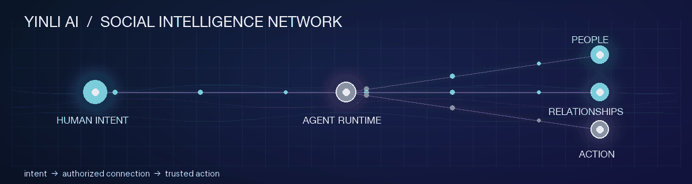
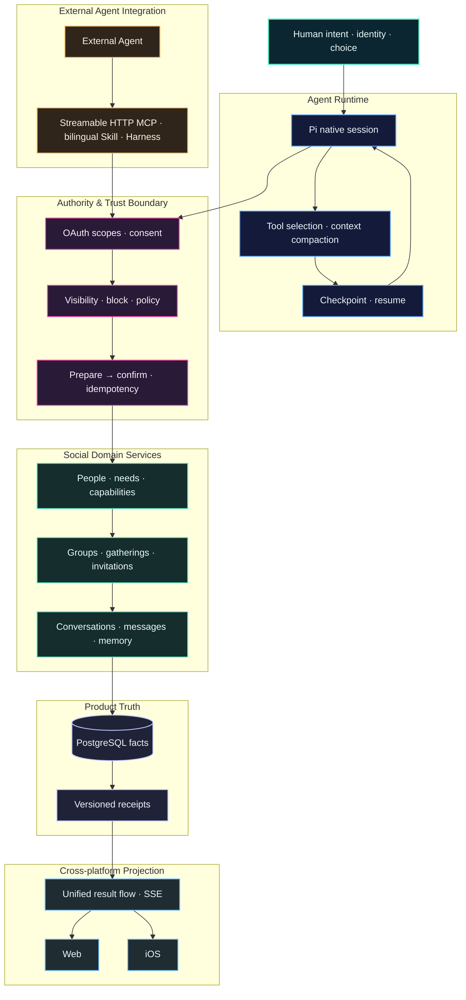

# 刘崇江 · Liu Chongjiang

  

**构建 AI 原生的人际互联即时通讯网络**  
**Building SI-native social infrastructure for human connection**

青岛大学 · [15253005312@163.com](mailto:15253005312@163.com) · [fitmeet.cn](https://fitmeet.cn/)

我正在构建 **引力AI（Yinli AI，原名 FitMeet）**：一个以人为核心、由 Agent 作为社会连接器的 **SI（Social Intelligence）原生人际互联即时通讯网络**。

I build **Yinli AI (formerly FitMeet)** — an AI-native social messaging network where people remain the source of identity, consent, and relationship authority, while Agents help turn intent into trusted human connection and real-world action.

## 方向 · Thesis

传统社交产品连接的是内容、账号或推荐结果；我关注的是把人的自然语言意图，转化为**可授权、可验证、可恢复的人际连接与即时沟通**。

The core problem I work on is the **intent → relationship → action** path: how an Agent can understand what a person is trying to do, discover relevant people or capabilities, and move the next step into an auditable conversation without taking authority away from the human.

## 我做过什么 · Engineering scope

- **Social intelligence layer**：围绕附近、组局、群聊、悬赏和赚钱等入口，建模人、需求、能力、群体、邀请、消息与关系推进。
- **Agent-native runtime**：集成完整 Pi 原生会话，处理工具选择、长会话、上下文压缩、有界工作集、检查点和重启接续。
- **Trust and action boundary**：以精确授权、来源版本、隐私/可见范围校验和幂等回执约束连接、邀请、组局和消息等社交动作。
- **Cross-platform projection**：让网站与 iOS 共享统一的结果流、状态和业务事实，保持一个任务在 Agent、事项和消息之间连续。
- **Open Agent integration**：建设 Streamable HTTP MCP、OAuth、双语 Agent Skill 与 Harness 插件，让外部 Agent 在授权范围内进入同一人际网络。

## 架构视角 · Architecture

系统将**推理、授权、事实、投影和恢复**拆成独立边界：Agent 负责理解与编排，FitMeet 服务负责身份、权限、社交事实和最终写入，网站、iOS 与外部 Agent 共享同一结果来源。

这套边界让社交动作具备可审计的授权链、可恢复的运行状态，以及跨 Web、iOS 和外部 Agent 的一致投影。

## 主要作品 · Selected work

### 引力AI（Yinli AI / FitMeet）

网站：[fitmeet.cn](https://fitmeet.cn/) · iOS App：**引力AI**

从 Agent 理解意图，到发现人、需求与能力，再到授权后的沟通和行动协作，持续构建 Web 与 iOS 的完整产品链路。

### [human-network](https://github.com/liudejua27-blip/human-network)

引力AI的人际互联即时通讯网络 MCP 服务与双语 Agent Skill，为外部 Agent 提供受控的搜索、关系与沟通入口。

### [fitmeet-dsh-plugin](https://github.com/liudejua27-blip/fitmeet-dsh-plugin)

面向 DeepSeek Harness 的引力AI中英文插件，把人际网络能力接入 Agent 工作流。

### [FitMeet-web](https://github.com/liudejua27-blip/FitMeet-web)

Web + Agent 需求流原型：从自然语言需求进入候选发现、匹配、消息与关系推进。

### [jev-huamn](https://github.com/liudejua27-blip/jev-huamn)

关于人类行为风险、操纵性语言与人机交互安全的研究型项目。

## 技术重点 · Technical focus

`Agent Runtime` · `Pi` · `MCP` · `OAuth` · `TypeScript` · `JavaScript` · `Swift / SwiftUI` · `Python` · `Rust` · `Node.js` · `React` · `PostgreSQL`

## 工作原则 · Principles

- **Facts before inference**：业务事实、权限和状态由产品服务持有，Agent 负责理解与编排。
- **Consent before action**：发现、联系、发布和沟通都以明确授权为边界。
- **One result, many surfaces**：网站、iOS 和外部 Agent 共享同一结果身份与状态来源。
- **Recovery before retries**：用回执、版本和检查点恢复动作，而不是无边界重试。

## 联系我 · Contact

- Email: [15253005312@163.com](mailto:15253005312@163.com)
- Website: [fitmeet.cn](https://fitmeet.cn/)
- iOS: 引力AI
