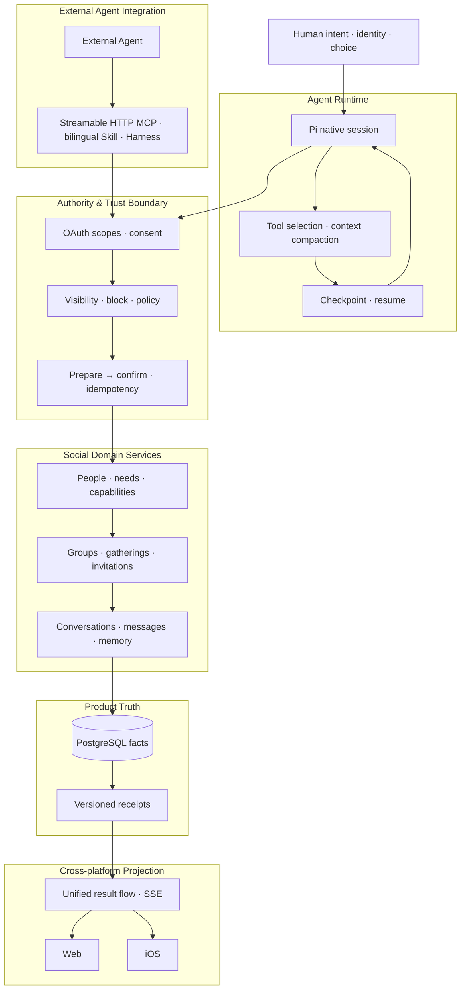

# Hi, I'm Liu Chongjiang · 刘崇江

🎓 Qingdao University · 🧠 Building **引力AI / Yinli AI** · ⚙️ AI-native social infrastructure

  <a href="https://fitmeet.cn">Website</a> ·
  <a href="https://apps.apple.com/cn/app/%E5%BC%95%E5%8A%9Bai-%E6%82%A8%E7%9A%84%E7%A4%BE%E4%BA%A4ai%E5%8A%A9%E6%89%8B/id6797005103">iOS App</a> ·
  <a href="https://fitmeet.cn/mcp">MCP</a> ·
  <a href="https://fitmeet.cn/developers/agent-setup">Docs</a> ·
  <a href="https://www.npmjs.com/package/fitmeet-dsh-plugin">npm · English</a> ·
  <a href="https://www.npmjs.com/package/fitmeet-dsh-plugin-zh">npm · 中文</a> ·
  <a href="https://skills.sh/liudejua27-blip/human-network/fitmeet">skills.sh</a> ·
  <a href="https://registry.modelcontextprotocol.io/v0.1/servers/io.github.liudejua27-blip%2Ffitmeet/versions/2.2.3">MCP Registry</a> ·
  <a href="https://smithery.ai/servers/liudejua27/fitmeet">Smithery</a>

I build **引力AI（Yinli AI，原名 FitMeet）**：一个以人为核心、由 Agent 作为社会连接器的 **SI（Social Intelligence）原生人际互联即时通讯网络**。

I work on the path from **intent → relationship → action**: helping an Agent understand what a person wants, discover relevant people or capabilities, and move the next step into an authorized, auditable conversation. Identity, consent and relationship authority remain with the human.

## What I work on

- **Agent runtime** — Pi-native sessions, tool selection, context compaction, bounded worksets, checkpoints and restart recovery.
- **Social intelligence layer** — people, needs, capabilities, groups, gatherings, invitations, conversations and memory.
- **Trust boundary** — OAuth scopes, consent, visibility and block checks, prepare → confirm flows, versioned actions and idempotent receipts.
- **Cross-platform projection** — one result contract across the Agent, Web and iOS, with SSE and shared business facts.
- **Open Agent integration** — Streamable HTTP MCP, bilingual Skills and DeepSeek Harness plugins for external Agent clients.

## 引力AI ecosystem

- 🧲 **[引力AI / Yinli AI](https://fitmeet.cn/)** — Web and iOS product for human connection, relationship communication and coordinated action.
- 🔌 **[human-network](https://github.com/liudejua27-blip/human-network)** — MCP service and bilingual Agent Skill for the SI-native network.
- 🧩 **[fitmeet-dsh-plugin](https://github.com/liudejua27-blip/fitmeet-dsh-plugin)** — DeepSeek Harness integration · [npm English](https://www.npmjs.com/package/fitmeet-dsh-plugin) · [npm 中文](https://www.npmjs.com/package/fitmeet-dsh-plugin-zh).
- 🖥️ **[FitMeet-web](https://github.com/liudejua27-blip/FitMeet-web)** — Web + Agent demand-flow prototype from natural-language intent to discovery, matching and messaging.
- 🧪 **[jev-huamn](https://github.com/liudejua27-blip/jev-huamn)** — Research project on behavioral risk, manipulative language and human–AI interaction safety.

## Architecture

The system separates **reasoning, authority, facts, projection and recovery** into explicit boundaries. This keeps Agent orchestration flexible while the product services retain identity, permissions, social facts and final writes.

Open the system view

## Technical focus

`Agent Runtime` · `Pi` · `MCP` · `OAuth` · `TypeScript` · `JavaScript` · `Swift / SwiftUI` · `Python` · `Rust` · `Node.js` · `React` · `PostgreSQL`

## Principles

- **Facts before inference** — business facts, permissions and state stay with product services; Agents interpret and orchestrate.
- **Consent before action** — discovery, contact, publication and messaging follow explicit authorization.
- **One result, many surfaces** — Web, iOS and external Agents share the same result identity and state source.
- **Recovery before retries** — receipts, versions and checkpoints make long-running work recoverable.

## Connect

- Website: [fitmeet.cn](https://fitmeet.cn/)
- iOS: [引力AI：您的社交AI助手](https://apps.apple.com/cn/app/%E5%BC%95%E5%8A%9Bai-%E6%82%A8%E7%9A%84%E7%A4%BE%E4%BA%A4ai%E5%8A%A9%E6%89%8B/id6797005103)
- Developer docs: [Agent setup](https://fitmeet.cn/developers/agent-setup) · [MCP](https://fitmeet.cn/mcp)
- Distribution: [skills.sh](https://skills.sh/liudejua27-blip/human-network/fitmeet) · [Official MCP Registry](https://registry.modelcontextprotocol.io/v0.1/servers/io.github.liudejua27-blip%2Ffitmeet/versions/2.2.3) · [Smithery](https://smithery.ai/servers/liudejua27/fitmeet)
- Email: [15253005312@163.com](mailto:15253005312@163.com)
